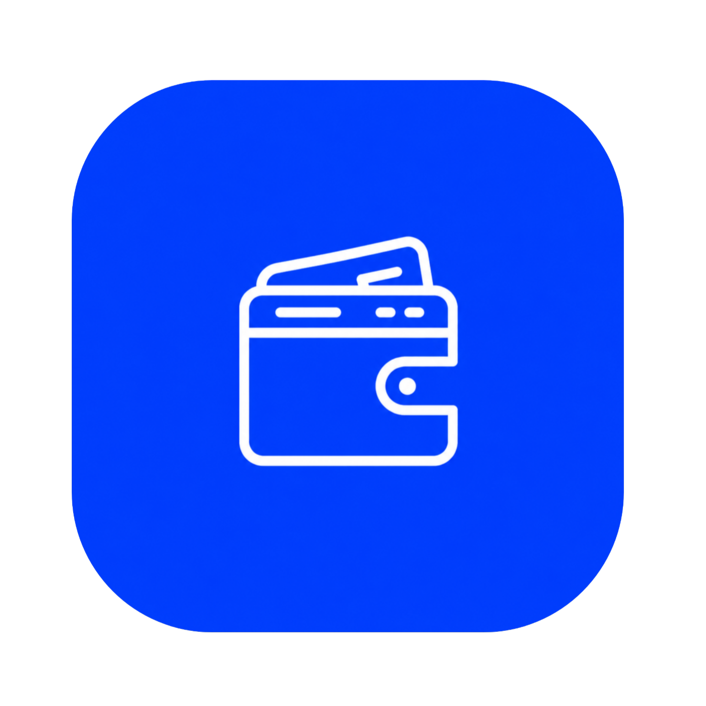
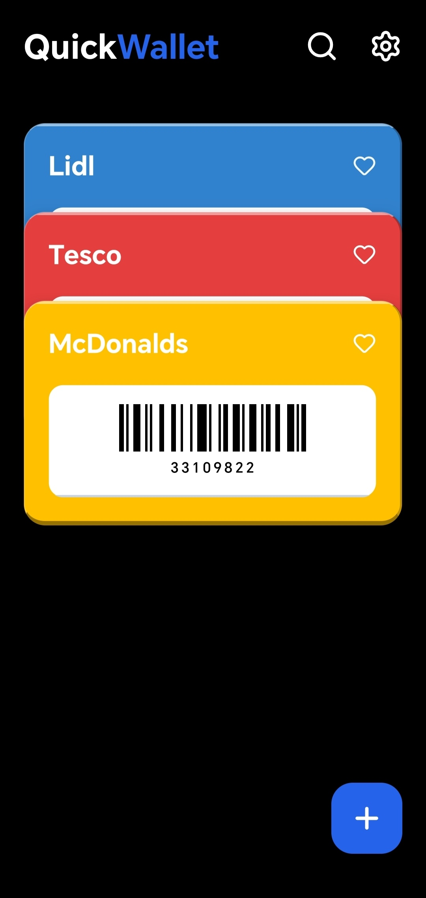
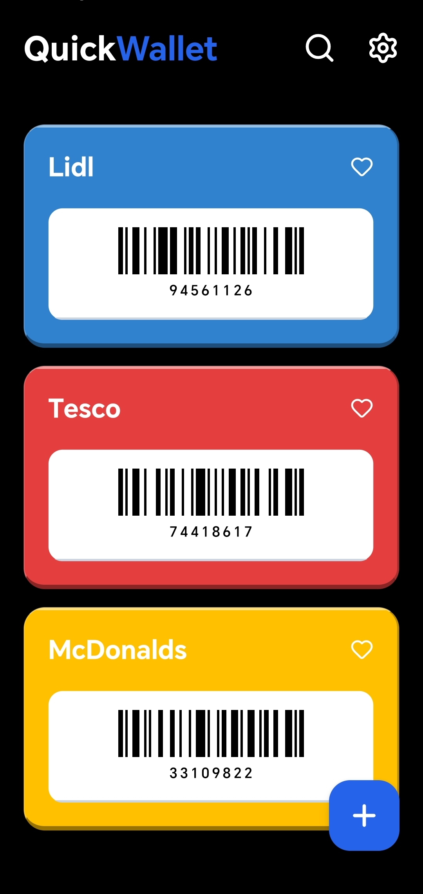
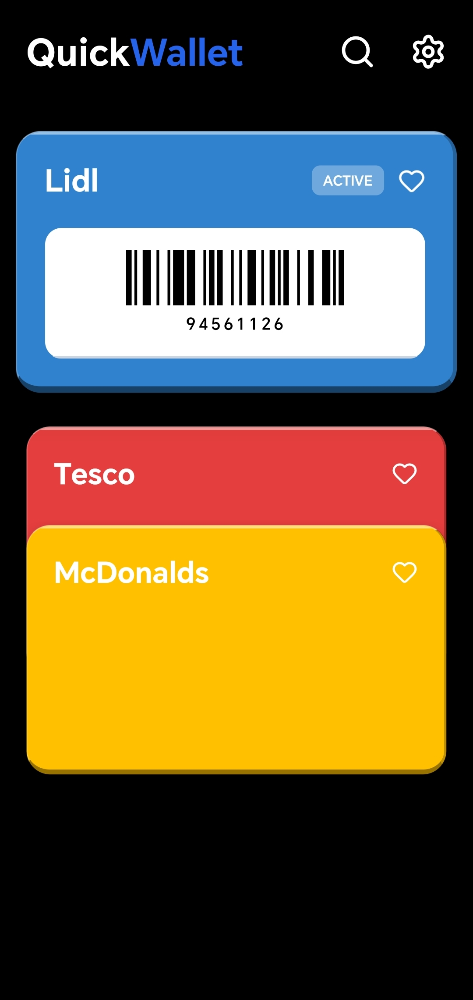

  

<h1 align="center" class="notranslate" translate="no">QuickWallet</h1>

A fast, clean, privacy-friendly wallet app for your loyalty and membership cards. Scan a barcode or QR code once, and never dig through your physical card stack at checkout again.

Built with Expo / React Native.

---

## ✨ Features

### Card management
- **Add cards** by scanning a barcode or QR code with the camera or importing an image from your gallery.
- **Wide format support**: EAN-13, EAN-8, CODE128, CODE39, UPC-A, UPC-E, PDF417, Aztec, and QR codes.
- **Custom colors** for each card, so your wallet stays easy to scan visually.
- **Favorites** — pin the cards you use most.
- **Search** — instantly filter your cards by name.
- **Drag & drop reordering** — long-press a card to flip it into reorder mode, then drag it into place.

### Everyday use
- **Tap to focus** — tap any card to bring it front and center with a dimmed background for easy scanning at the register.
- **Automatic brightness boost** while a card is open, so barcode/QR scanners can read it more reliably (on by default, can be turned off in Settings).
- **Swipe actions** — swipe a card left to delete or right to link it to an app, each independently toggleable in Settings. When a direction is disabled, that swipe gesture is fully disabled too — no accidental drags.
- **Link an app to a card** — attach any installed app to a card (e.g. a store's own app) and jump straight into it from your wallet.

### Look & feel
- **Light / Dark / System** theme, plus a true-black **AMOLED** mode for extra battery savings.
- Smooth, physics-based animations throughout — card focus, reordering, swipe gestures, and sheet transitions all feel native rather than abrupt.

### Security & data
- **Biometric lock** (Face ID / fingerprint) on app launch.
- **Backup & restore** — download a backup file, share it, or import one to restore your cards and settings on another device.
- All data is stored locally on your device — nothing is uploaded anywhere.

### Convenience
- **Update checks** — QuickWallet can automatically check for new releases on launch (toggleable), or you can check manually from Settings.
- **Multi-language** — available in **Hungarian** and **English**.

---

## 📸 Screenshots

  
  
  

---

## 📲 Download

QuickWallet is distributed as an APK via **[GitHub Releases](https://github.com)** — this repository does not include the source code, only the compiled app.

### ⚠️ About the Google Play Protect warning

Because the app isn't published on the Play Store, **Google Play Protect may show a warning** (e.g. *"Unsafe app blocked"* or *"App wasn't scanned for harmful behavior"*) when you try to install it. This is expected and not a sign that anything is wrong — it simply means the app hasn't gone through Google's Play Store review process, which only applies to apps installed from outside the Store.

**How to install anyway:**

1. When the warning appears, tap **"More details"** (or the ⓘ icon).
2. Tap **"Install anyway"** (or **"Install without scanning"**).
3. If Play Protect blocks the install entirely before you even see that option:
   - Open the **Play Store** app → tap your profile icon → **Play Protect** → ⚙️ **Settings**.
   - Turn off **"Scan apps with Play Protect"** temporarily, install the APK, then turn it back on if you'd like.
4. Only download the APK from the official [Releases page](https://github.com) of this repository — never from a third-party mirror.

---

## 🛠️ Tech Stack

- [Expo](https://expo.dev) / React Native
- `expo-camera` — barcode/QR scanning
- `expo-local-authentication` — biometric app lock
- `expo-brightness` — automatic brightness boost
- `expo-document-picker`, `expo-application`, `expo-system-ui`
- `react-native-barcode-svg` — barcode rendering
- `@react-native-async-storage/async-storage` — local persistence
- `lucide-react-native` — icons

---

## 🤝 Contact & Links

Made by **akosdevhu**.

- 🐙 GitHub: [github.com](https://github.com/akosdevhu)
- 📸 Instagram: [instagram.com](https://www.instagram.com/akosdevhu)
- ✉️ Email: [akosdevhu@gmail.com](mailto:akosdevhu@gmail.com)

Feedback, bug reports, and feature suggestions are always welcome — feel free to open an issue or reach out directly.

---

## 📄 License

No license has been specified for this project yet. All rights reserved unless a license file is added.
